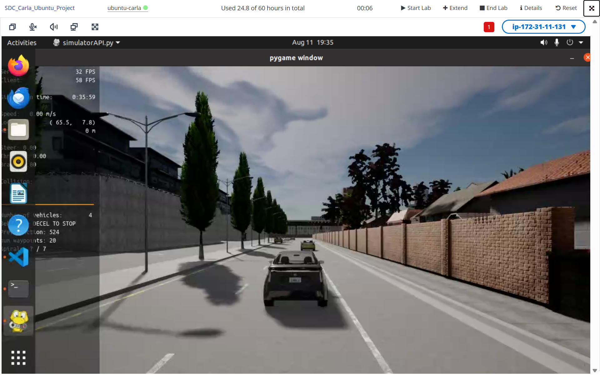
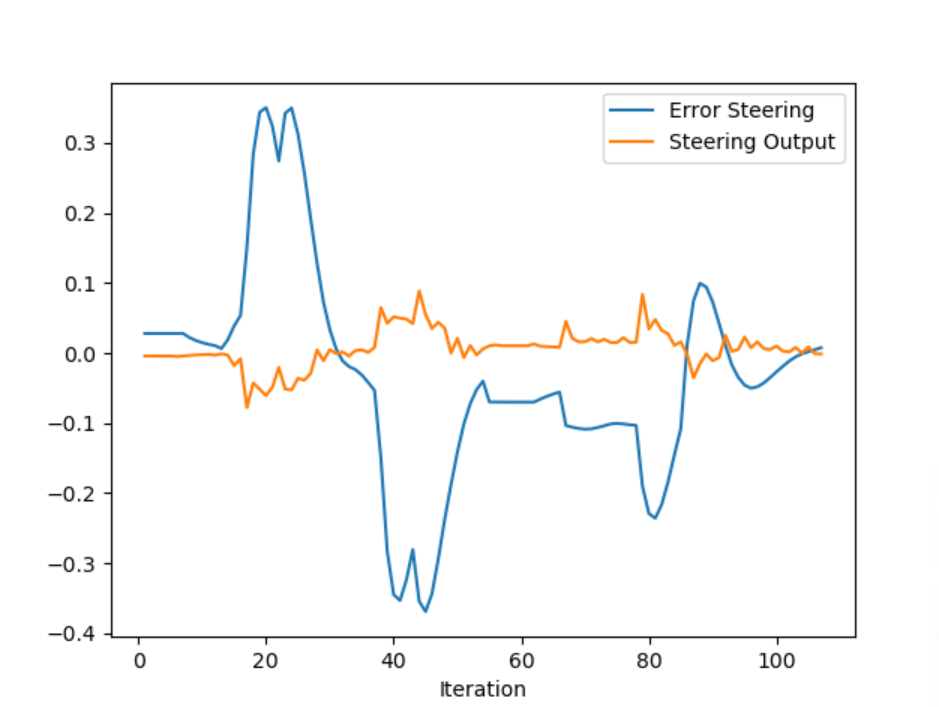
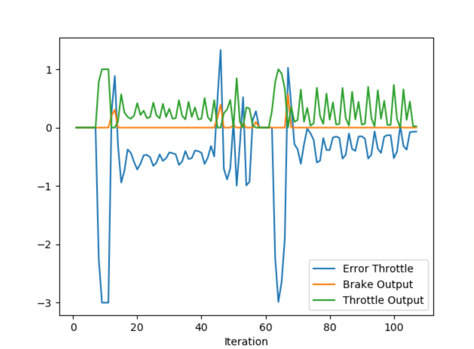

## Control and Trajectory Tracking for Autonomous Driving

- 
- 
- In the steering graph, it is evident that the derivative component played the most significant role in shaping the response. Although there were sudden adjustments in the steering, they were sufficient to keep the car on course and prevent collisions.
- 
- In the throttle graph, it can be observed that the proportional component of the PID responded quickly to compensate for the error, while the derivative component was strong enough to limit overshoot, allowing the system to maintain the desired velocity. However, there is still room for improvement in the parameter tuning, as the braking response of the car was not very smooth. 
- What is the effect of the PID according to the plots, how each part of the PID affects the control command?
  - The proportional term in a PID controller generates a control signal that is directly proportional to the current error. The impact on control is straightforward: a larger error results in a stronger control action, while a smaller error produces a weaker response. On a plot, the control command increases linearly with the error, meaning the system reacts quickly to large deviations from the setpoint.
  - The integral term in a PID controller addresses accumulated error over time by summing past errors to eliminate steady-state offsets, if the integral gain is too high, it can lead to excessive overshoot and instability due to accumulated error. On a plot, the control signal due to the integral term builds up progressively.
  - The derivative term in a PID controller reacts to the rate of change of the error, helping to predict and counteract future errors by dampening the system's response, effectively reducing overshoot and oscillations in the system. On a plot, the control command increases or decreases in response to rapid changes in error.
- How would you design a way to automatically tune the PID parameters?
  - Genetic algorithms can be effectively used to tune PID controller parameters by treating the proportional, integral, and derivative gains as a set of decision variables to be optimized. In this approach, each potential PID configuration is represented as a chromosome, and its performance is evaluated using a fitness function based on control criteria such as overshoot, settling time, and steady-state error.
  - Reinforcement Learning (RL) is powerful because it doesn’t need labeled data, only feedback from performance, also a RL agent can directly interact with the simulation and adjust PID parameters to maximize a reward.
- PID controller is a model free controller, i.e. it does not use a model of the car. Could you explain the pros and cons of this type of controller?
  - Pros: It does not rely on a mathematical model of the system, making it useful when the dynamics are complex or difficult to capture accurately. It's simple to implement, and requires low computational effort.
  - Cons: Limited adaptability and performance in complex or changing environments. Since it relies solely on error feedback, it struggles with nonlinear systems, disturbances, or variations in operating conditions, and tuning the controller parameters can be time-consuming and system-specific.
- What would you do to improve the PID controller?
  - Include the mathematical model of the dynamics of the car and its kinematics too.
  - Auto tune of the parameters with one of the preview mentioned posibilities. 
